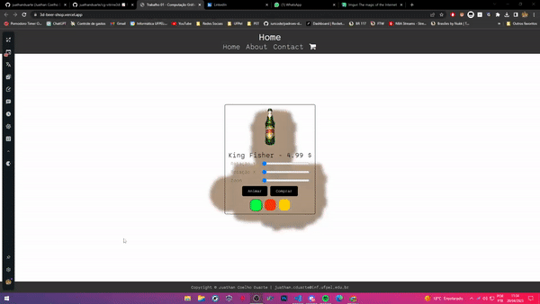

# Vitrine 3D

Esta é uma aplicação web que permite aos usuários explorarem uma vitrine virtual em 3D, onde podem olhar e comprar itens utilizando WebGL. A aplicação oferece uma experiência imersiva e interativa, permitindo aos usuários controlarem a visualização dos objetos, animar os objetos, mudar as texturas e cores além de adicionar itens ao carrinho de compras.

- Link de acesso: https://3d-beer-shop.vercel.app/

## Recursos

A aplicação oferece os seguintes recursos:

- **Visualização em 3D:** Todos os objetos na vitrine são renderizados em 3D utilizando WebGL, proporcionando uma experiência realista e interativa.
- **Controles de Animação:** Os usuários podem controlar a rotação, o zoom e a animação pré-definida da câmera dos objetos na vitrine, permitindo uma exploração detalhada dos itens.
- **Carrinho de Compras:** Todos os itens que o usuário comprar são adicionados a uma visão única, representada por uma garagem ou pátio, onde é possível visualizar todos os itens adquiridos.
- **Animação de Fundo:** O fundo da página é uma animação em WebGL, que adiciona um elemento visual dinâmico e atrativo à aplicação.
- ✨ Magia ✨

## Tecnologias Utilizadas

A aplicação é desenvolvida utilizando as seguintes tecnologias:

- **WebGL:** É uma API JavaScript para renderização de gráficos em 3D no navegador, sendo amplamente utilizada para criar aplicações de visualização em 3D.
- **Editor de Imagens:** É utilizado um editor de imagens para customizar as texturas dos objetos, permitindo a troca de cores e a criação de texturas personalizadas.

## Como utilizar

1. Clone o repositório para o seu ambiente local.
2. Abra o arquivo index.html em um navegador web compatível com WebGL.
3. Utilize os controles disponíveis na interface para explorar a vitrine em 3D.
4. Clique no menu para trocar as texturas e cores dos objetos.
5. Os itens que forem comprados serão adicionados à visão única do carrinho de compras.
6. Divirta-se explorando a vitrine 3D e comprando itens personalizados!

## Autor

Esta aplicação foi desenvolvida por Juathan Coelho Duarte. Entre em contato pelo e-mail juathanduarte13@gmail.com para mais informações.  
Agradecimentos especiais a Rafael Piccin Torchelsen por todo suporte.
